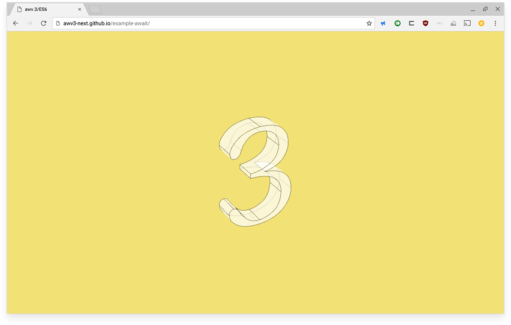

Simple example demonstrating async lifecycles.

[Live demo](http://awv3-next.github.io/example-await/)

# Install and run

git clone https://github.com/awv3-next/example-await

cd example-await

npm install && npm start

# Build

npm run build
