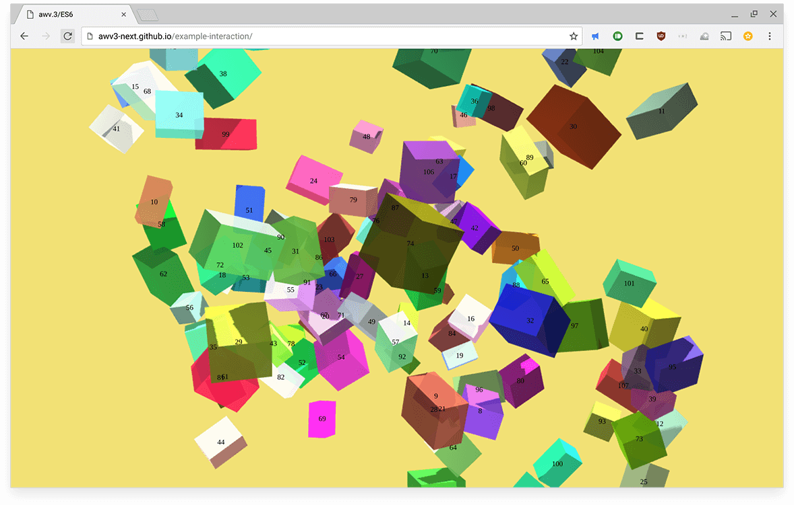

Simple example demonstrating a how to set up a view, load a model and create a basic interaction layer.

[Live demo](http://awv3-next.github.io/example-interaction/)

# Install and run

git clone https://github.com/awv3-next/example-interaction

cd example-interaction

npm install && npm start

# Build

npm run build
